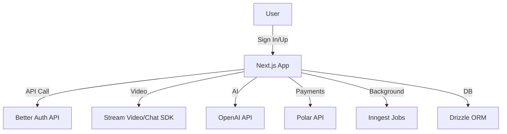
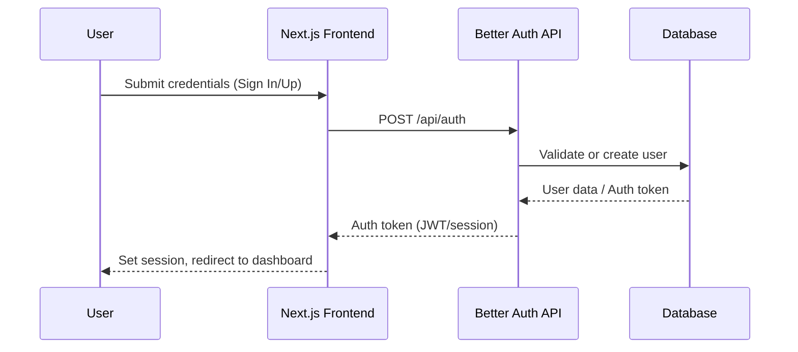

# Meet AI Platform 🚀

Next-generation video conferencing powered by AI: smarter, more productive, and effortlessly organized.

---

## 🌟 Features


| Core Functionality         | AI Capabilities           |
|---------------------------|---------------------------|
| AI-Powered Video Calls    | Custom Real-time Agents   |
| Smart Meeting Summaries   | AI Q&A                    |
| Meeting Recordings        | OpenAI Integration        |
| Transcript Search         | Smart Transcripts         |

---

## 🛠️ Technical Stack

| Layer         | Technology                                    |
| ------------- | --------------------------------------------- |
| Frontend      | Next.js 15, React 19, Tailwind CSS v4         |
| UI Components | shadcn/ui                                     |
| Auth          | Better Auth                                   |
| Real-time     | Stream Video SDK, Stream Chat SDK             |
| Background    | Inngest (background jobs)                     |
| Payments      | Polar subscriptions                           |
| DB/ORM        | Drizzle ORM                                   |
| Package Mgmt  | Bun, npm, or yarn                             |
| Deploy        | AWS Amplify                                   |

---

## 📐 Architecture Overview



---

## 🔐 Authentication Flow



---

## 📦 Main Endpoints (API)

| Endpoint                        | Method | Description                        |
|---------------------------------|--------|------------------------------------|
| `/api/auth/sign-in`             | POST   | User login                   |
| `/api/auth/sign-up`             | POST   | User registration                |
| `/api/meetings`                 | GET    | List meetings                   |
| `/api/meetings`                 | POST   | Create new meeting                |
| `/api/meetings/:id`             | GET    | Get meeting details        |
| `/api/meetings/:id/summary`     | GET    | Get AI meeting summary   |
| `/api/meetings/:id/recording`   | GET    | Download recording                |
| `/api/payments/subscribe`       | POST   | Subscribe via Polar              |

---

## ⚙️ Environment Variables

Set up your variables in `.env.local`:

| Variable              | Description                                 |
|-----------------------|---------------------------------------------|
| `STREAM_API_KEY`      | Stream Video/Chat credential             |
| `STREAM_API_SECRET`   | Stream Video/Chat secret                |
| `OPENAI_API_KEY`      | OpenAI Key                            |
| `BETTER_AUTH_SECRET`  | Secret for Better Auth                    |
| `POLAR_API`           | Key for Polar payments                  |
| ...                   | See `.env.example` for more details        |

---

## 🚀 Getting Started

### Prerequisites
- Node.js 18+
- Bun (opcional, recomendado)
- npm o yarn
- Credenciales de Stream
- API Key de OpenAI

### Installation

```bash
# Clone the repository
git clone https://github.com/LostoVayne/meet-ai-platform.git
cd meet-ai-platform

# Install dependencies (choose one)
bun install
# o
npm install
# o
yarn

# Set environment variables
cp .env.example .env.local

# Start the development server
bun dev
# o
npm run dev
# o
yarn dev
```

---

## 🚀 Deploy on AWS Amplify

1. Connect your repository in AWS Amplify.
2. Set up environment variables in the Amplify panel.
3. Amplify detecta Next.js y usa `amplify.yml` para el build.
4. Deployment is automatic on each push to the main branch.

---

## 🧩 Using shadcn/ui

- Componentes reutilizables en `src/components/ui/`.
- Ejemplo:

```tsx
import { Button } from "@/components/ui/button";

<Button variant="primary">Start meeting</Button>
```

---

## 🔑 Better Auth

- Autenticación segura y moderna.
- Flujos en `src/app/(auth)/sign-in` y `sign-up`.
- Vistas personalizadas en `src/modules/auth/ui/views/`.

---

## 💳 Polar (Payments and Subscriptions)

- Integration with Polar for subscriptions and payments.
- Set your key in environment variables.
- The payment flow is handled from the dashboard.

---

## 📚 Rules and best practices

- Usa **Bun** para desarrollo rápido y eficiente.
- Follow Next.js folder convention (app router).
- Componentes UI en `src/components/ui/`.
- Hooks personalizados en `src/hooks/`.
- Keep dependencies updated.
- Usa ESLint y Prettier para mantener el código limpio.
- Do not upload keys or secrets to the repository.

---

## 🧪 Testing

- Coming soon: integration with Jest and E2E tests.

---

## 🤝 Contribute

1. Fork the repository.
2. Create a branch for your feature/fix.
3. Make a PR describing your changes.

---

## 📞 Support

Questions or suggestions? Open an issue or contact [shubhangampandey](https://github.com/shubhangampandey).
